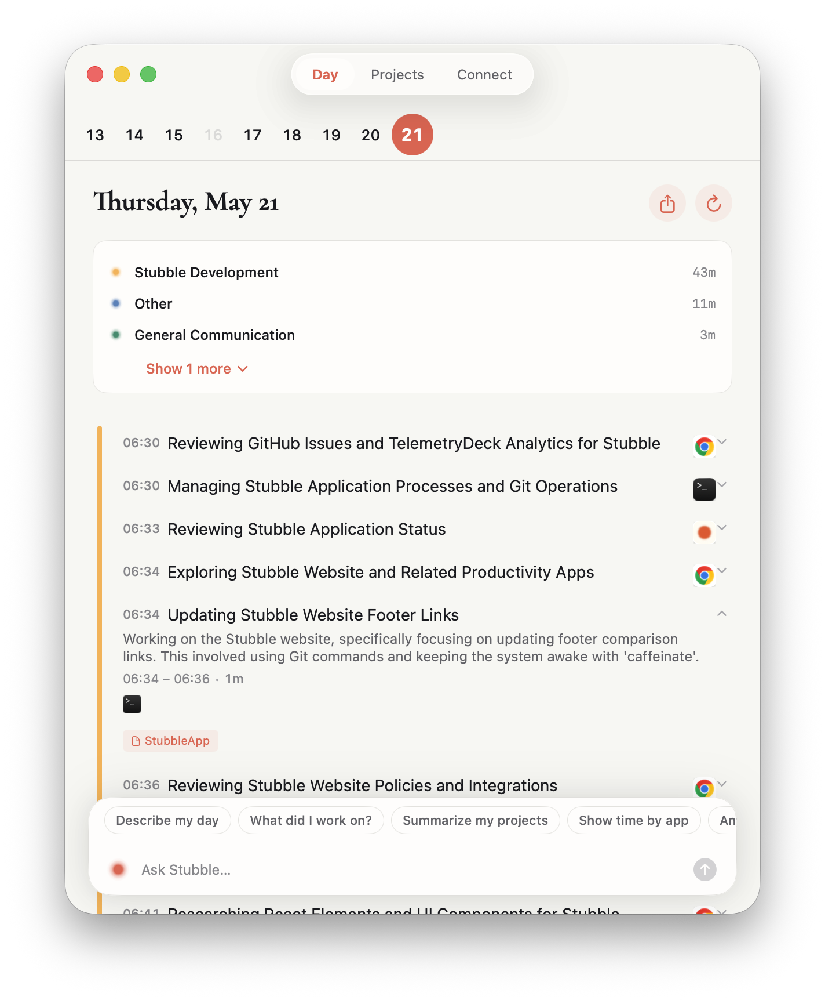
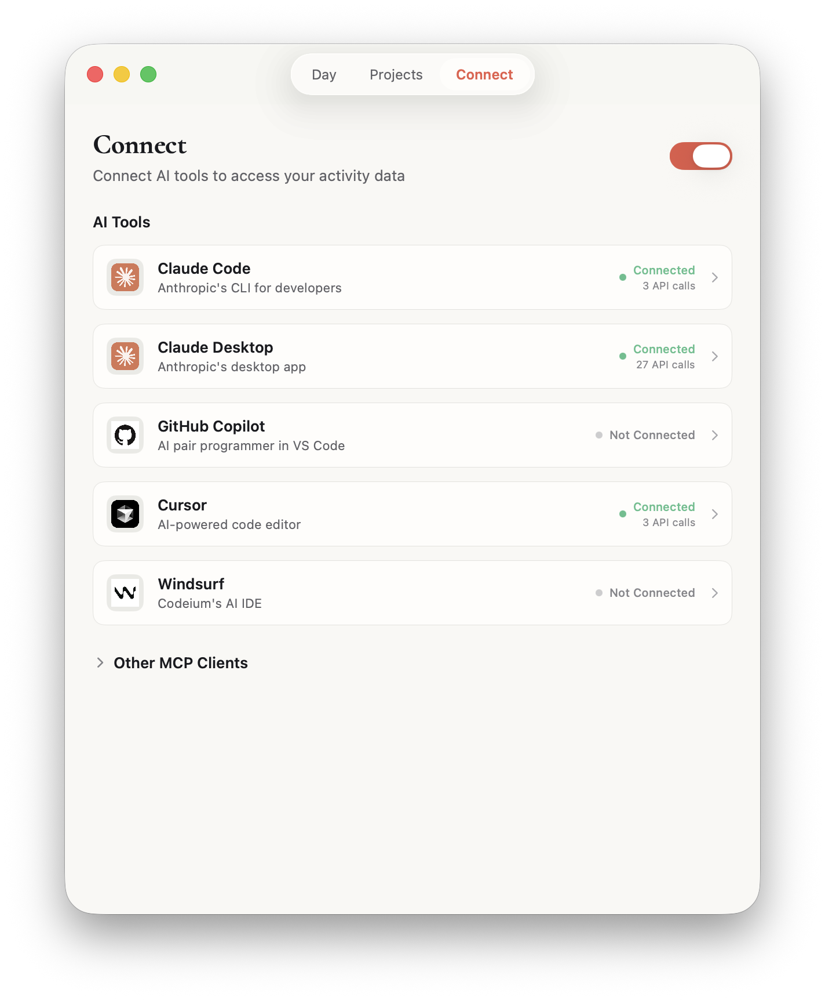

<p align="center">
  
</p>

<h1 align="center">Stubble</h1>

<p align="center">
  <a href="LICENSE"></a>
  <a href="https://www.apple.com/macos/"></a>
  <a href="https://swift.org"></a>
</p>

<p align="center"><strong>Context infrastructure for AI agents.</strong></p>

<p align="center">
Stubble captures what you're working on and makes that context available to AI tools like Claude Code, Cursor, and other MCP-compatible agents. We focus on doing one thing extremely well: understanding your work and exposing it efficiently to AI.
</p>

<p align="center">
  
  
</p>

https://github.com/stubbleapp/stubble/raw/refs/heads/main/Resources/Screenshots/Stubble_Claude_Video.mp4

## Philosophy

We are **not** a do-everything AI app. We don't compete with Claude or ChatGPT — we make them smarter.

| What we do | What we don't do |
|------------|------------------|
| Capture screen activity with high fidelity | Audio capture or transcription |
| Build a knowledge graph of your work | Plugin/extension systems |
| Learn about you over time (persistent memory) | Cross-platform support |
| Expose context to AI via MCP | Be the AI that answers questions |
| Optimize for minimal token usage | Enterprise features |

Our goal: when you use Claude Code or Cursor with Stubble connected, your AI actually understands your projects, your tech stack, and what you were doing this morning.

## Features

- **MCP server** — Exposes your work context to Claude Code, Cursor, and other AI tools
- **Knowledge graph** — Builds semantic understanding of your projects, technologies, and skills
- **Persistent memory** — Learns about your role and work patterns with confidence decay
- **Activity monitoring** — Tracks app switches, window titles, browser URLs, and document paths
- **Screen capture** — Periodic screenshots with local OCR (Apple Vision)
- **File system tracking** — Monitors changes in your code and document directories
- **Calendar & meeting integration** — Integrates with macOS Calendar and Granola meeting notes
- **AI-powered task grouping** — Clusters raw activity into meaningful tasks
- **Token optimization** — Synthesizes context efficiently so AI tools get signal, not noise

## Quick Start

### Option 1: Hosted Service

The easiest way to use Stubble is with the hosted service at [stubble.ai](https://stubble.ai):

1. Download from [stubble.ai](https://stubble.ai)
2. Move `Stubble.app` to Applications
3. Launch and follow the setup wizard
4. Sign in with Google (5-day free trial)

### Option 2: Self-Hosted with Direct API Mode

If you prefer to use your own Gemini API key without any backend:

```bash
# Clone the repository
git clone https://github.com/stubbleapp/stubble.git
cd stubble

# Set your Gemini API key
export GEMINI_API_KEY="your-gemini-api-key"

# Build with ad-hoc signing (no Developer ID required)
export CODESIGN_IDENTITY="-"
export SPARKLE_FEED_URL=""
export SPARKLE_ED_KEY=""
export TELEMETRY_DECK_APP_ID=""

bash scripts/build-app.sh

# Run the app
open build/Stubble.app
```

In direct API mode, requests go straight to Google's Gemini API — no Supabase or Cloudflare Worker needed.

### Option 3: Full Self-Hosted Stack

For complete control, you can deploy your own backend. See [docs/SELF_HOSTING.md](docs/SELF_HOSTING.md) for:

- Supabase project setup (authentication)
- Cloudflare Worker deployment (API proxy with rate limiting)
- Building the app with your own credentials

## Building from Source

### Requirements

- macOS 14.0 (Sonoma) or later
- Xcode 15+ or Swift 5.9+ toolchain
- (Optional) Developer ID certificate for distribution

### Build

```bash
# Clone
git clone https://github.com/stubbleapp/stubble.git
cd stubble

# Build
bash scripts/build-app.sh

# Run
open build/Stubble.app
```

### Environment Variables

See [docs/CONFIGURATION.md](docs/CONFIGURATION.md) for all available options. Key variables:

| Variable | Description | Default |
|----------|-------------|---------|
| `GEMINI_API_KEY` | Direct Gemini API key (bypasses proxy) | — |
| `STUBBLE_SUPABASE_URL` | Supabase project URL | Placeholder |
| `STUBBLE_SUPABASE_ANON_KEY` | Supabase anon key | Placeholder |
| `STUBBLE_PROXY_URL` | Cloudflare Worker URL | Placeholder |
| `CODESIGN_IDENTITY` | Code signing identity (`-` for ad-hoc) | Developer ID |
| `SPARKLE_FEED_URL` | Auto-update feed URL (empty to disable) | GitHub releases |
| `TELEMETRY_DECK_APP_ID` | Analytics app ID (empty to disable) | — |

## Architecture

Stubble consists of two processes:

1. **Dashboard** — SwiftUI app with menu bar presence
2. **Daemon** — Background process that collects activity data

```
┌─────────────────────────────────────────────────────────────────────┐
│                           DAEMON PROCESS                            │
│  ┌─────────────┐  ┌─────────────┐  ┌─────────────┐  ┌────────────┐ │
│  │ Activity    │  │ Window      │  │ Idle        │  │ File       │ │
│  │ Monitor     │  │ Title       │  │ Detector    │  │ Activity   │ │
│  └──────┬──────┘  └──────┬──────┘  └──────┬──────┘  └──────┬─────┘ │
│         └────────────────┴────────────────┴────────────────┘       │
│                                  │                                  │
│                                  ▼                                  │
│                   ┌──────────────────────────┐                     │
│                   │    DatabaseManager       │                     │
│                   │    (SQLite + WAL)        │                     │
│                   └──────────────────────────┘                     │
│                                  │                                  │
│                                  ▼                                  │
│                   ┌──────────────────────────┐                     │
│                   │    TaskSummarizer        │───▶ Gemini API      │
│                   │    (every 15 min)        │                     │
│                   └──────────────────────────┘                     │
└─────────────────────────────────────────────────────────────────────┘
```

See [docs/ARCHITECTURE.md](docs/ARCHITECTURE.md) for detailed diagrams.

## Data Storage

All data is stored locally in `~/Library/Application Support/Stubble/`:

| File | Contents |
|------|----------|
| `stubble.db` | SQLite database (activities, tasks, projects) |
| `screenshots/` | JPEG files organized by date |
| `settings.json` | Preferences and configuration |
| `memory.json` | Learned context about your work |

Screenshots are automatically pruned (images after 100, full records after 30 days).

## MCP Server

Stubble exposes a local [MCP](https://modelcontextprotocol.io) server that allows AI tools to access your activity data:

```bash
# Show your API key
/Applications/Stubble.app/Contents/MacOS/stubble-mcp --show-key

# Connect Claude Code
claude mcp add-json stubble '{"type":"stdio","command":"/Applications/Stubble.app/Contents/MacOS/stubble-mcp","env":{"STUBBLE_MCP_KEY":"sk-stubble-xxxx"}}' --scope user
```

See the Connect tab in Stubble for setup instructions for other AI tools.

## Privacy

- All data stays on your machine
- Screenshots are never uploaded
- Only activity metadata (titles, OCR text) is sent to the AI for summarization
- Direct API mode sends data only to Google's Gemini API
- Optional analytics can be disabled

## Contributing

Contributions are welcome! Please:

1. Fork the repository
2. Create a feature branch (`git checkout -b feature/amazing-feature`)
3. Commit your changes (`git commit -m 'Add amazing feature'`)
4. Push to the branch (`git push origin feature/amazing-feature`)
5. Open a Pull Request

## License

Licensed under the Apache License, Version 2.0. See [LICENSE](LICENSE) for details.

## Support

- **Issues**: [github.com/stubbleapp/stubble/issues](https://github.com/stubbleapp/stubble/issues)
- **Discussions**: [github.com/stubbleapp/stubble/discussions](https://github.com/stubbleapp/stubble/discussions)
